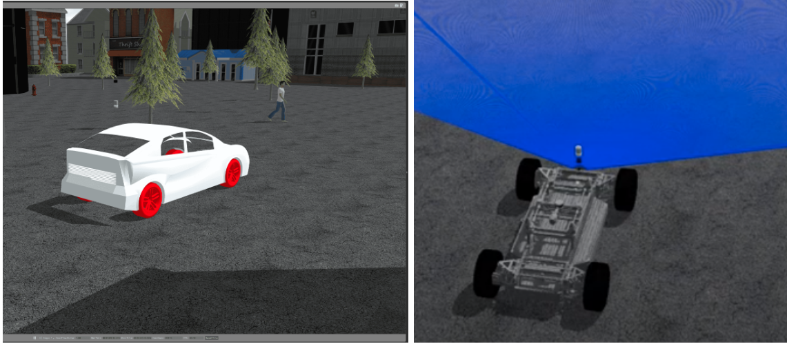
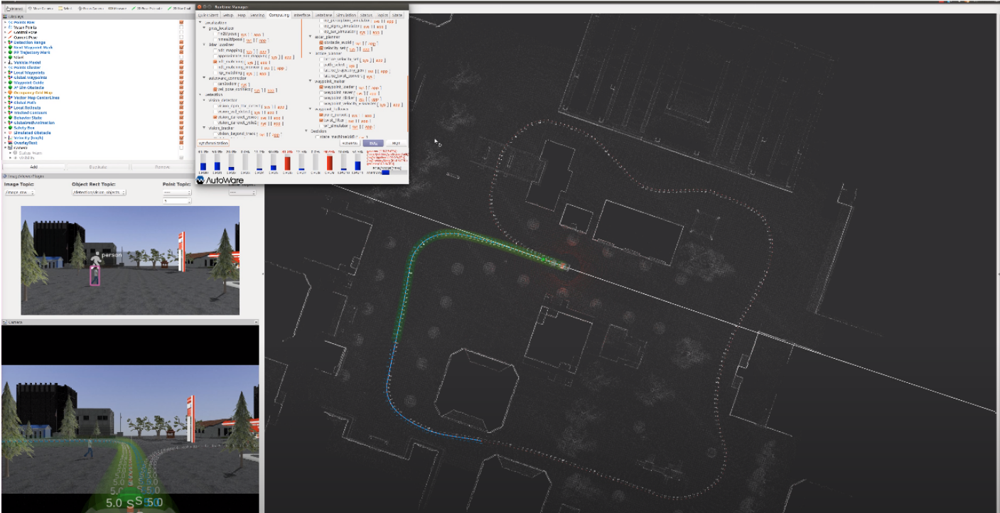
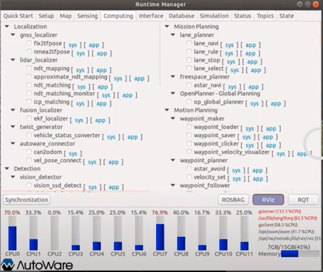
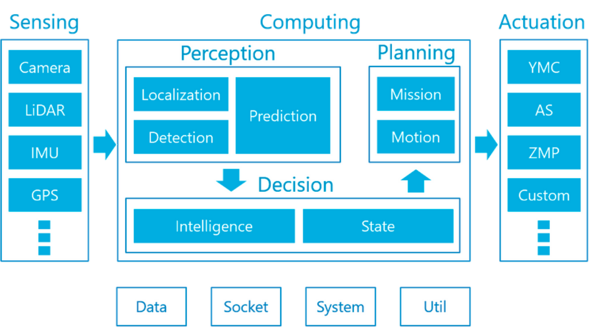

## Simulating and controlling an Ackermann drive chassis
### Requirements
- ROS (higher kinetic)
- gazebo (higher version 7)

 
Autoware is based on ROS and uses Gazebo for simulation. To simulate an ackermann vehicle we need to define an URDF or Xacro model. In this file we can change vehicle models, add actuators and sensors.
Autoware offers a default xacro file which can be customized for use, this is all available for download from [vehicle_sim](https://github.com/yukkysaito/vehicle_sim). To customize this model we need not change the xacro file. The vehicle dynamics can be changed in the config file `vehicle_model/config/caibration.yaml`. To customize the visual appearance of the vehicle we can use a custom mesh file. Collate (`.dae`) formats can be added to mesh folder and referenced in the vehicle.xacro file. We have later discussed how sensors can be added and customized.

*Figure 1. Different vehicle models*
 
 
### Available Worlds
Gazebo uses an ‘empty world’  which lacks any structures, to simulate the environment we need a world file. Autoware provides three templates of world files which can be downloaded from [car_sim](http://gazebosim.org/blog/car_sim )

*Figure 2. Gazebo worlds developed by autoware*
 
All three worlds also have the Point Cloud Maps (PCD files) available for download which are needed for NDT based localization.
One can always use other gazebo worlds but the PCD maps have to be manually generated and downsampled, the process can be found on [Autoware Documentation](https://readthedocs.org/projects/autoware/downloads/pdf/feature-documentation_rtd/)
 
## Using the path planning algorithms provided in Autoware
Autoware provides a number of different types of path planning algorithms. These include simpler ones like pure pursuit based on a set of pre-configured waypoints to dynamic path planning using LiDAR and camera based costmaps to a custom software package called OpenPlanner that can use vector maps and sensor data for planning.
### 1. Waypoint following:
- A set of waypoints can be generated by using the waypoint_saver node within Autoware, which will record the position, orientation and velocity at a customizable set of intervals. Within the simulation, the vehicle can be moved with teleoperation or other manual approaches, and in the real world, this may be with a joystick or manual control of the vehicle.
- The previously generated set of waypoints are loaded using the waypoint_loader node within Autoware.
- The lane_rule, lane_stop and lane_select topics are checked.
- The astar_avoid is selected (and if not selected, it will not use obstacle avoidance)
- The velocity_set is checked (configured for a fixed velocity between waypoints)
- The twist_filter node is checked (to allow for limiting of the resulting values for control of the vehicle)
- The vehicle interface nodes are selected (for control of the vehicle)
- The pure_pursuit node is checked (and at this point, the vehicle will start moving)

A sample image with waypoints is shown below.

 *Figure 3. Sample waypoints*
 
This shows how the waypoints provide a velocity and orientation at every location, and how pure pursuit plans a path that interpolates them, as well as a lookahead target for the vehicle while driving.
## 2. Using OpenPlanner for dynamic path planning
- Building a vector map with Tier IV or Assure Mapping Tools: this requires the use of proprietary softwares like Tier IV’s online Vector Map Builder tool, or the Assure Mapping Tools to build an HD vector map that provides lane, road sign/signal and other information for usage by OpenPlanner.
- Setup Autoware for localization for OpenPlanner. Launch the following nodes: ray_ground_filter (filters LIDAR ground points), vel_pose_connect (sends data through the control interface), lidar_euclidean_cluster_detect (identifies clusters within LiDAR data), lidar_kf_contour (tracks LiDAR point clouds using Kalman Filters), costmap_generator (uses LiDAR data to generate costmaps for future trajectories), op_global_planner (OpenPlanner planning from start to goal location), astar_avoid (local obstacle avoidance), velocity_set (sets maximum velocity at intermediate locations), pure_pursuit (follows the lookahead target for updating location), op_local_planner (OpenPlanner local planning). The local and global planners will use data from the vector map.
- The image below shows a set of lanes and wayareas drawn using Tier IV’s Vector Map Builder online tool. These need to be drawn very precisely and carefully to ensure that they work properly with Autoware. However, once this is done, it can do path planning for arbitrary start and goal locations on the map without requiring a prespecified set of waypoints.


*Figure 4. Vector Map*


## Simulating sensors and placing them in different locations on the vehicle
Autoware needs three sensors for efficient functioning
- Velodyne (VLP-16 or 32E)
- IMU
- Camera

However, more sensors can be added for custom use. Autoware provides drivers for all the mentioned sensors, more velodyne LiDAR drivers for gazebo can be found on [velodyne_driver](https://bitbucket.org/DataspeedInc/velodyne_simulator/src). All drivers that work on ROS and can be simulated using Gazebo can be added to Autoware with no extra effort, [Gazebo Sensor Tutorial](http://gazebosim.org/tutorials?tut=ros_gzplugins) can be referred for detailed tutorials. This includes but not limited to
- 2D Lidar
- GPS
- Compass
- Contact/Force Sensors

Various noise models can be simulated for the sensors, most of them use a parametric noise model.
Sensor Placement
Sensor position can be varied by in the configuration file `vehicle/vehicle_model/config/caibration.yaml`. Note: All the placement is relative to the rear axle center at ground level. 
Additional sensors positions can also be defined in this yaml file and later referenced in vehicle.xacro, this enables easily configuring the sensors and knowing the extrinsics by publishing the TF’s directly from the yaml file. 
 
### Visualizing Sensor Data
The Autoware GUI can be used to launch Rviz, this can be seen in the figure below

 
 *Figure 5. Autoware GUI*
 
Once Rviz is launched you can add sensors to visualize

*Figure 6. Rviz GUI*

To view all the sensor data in common frames we need to either visualize the base_link frame given that all sensor configurations have been correctly added. To visualize them relative to the world we need to enable localization and publish the `transform map -> odom -> base_link`. This can also be done using `p3d_base_controller` plugin in Gazebo and manually publishing a TF based on the topic assigned to the plugin. 
 
## Integrating and interfacing existing ROS packages with Autoware
Autoware contains different submodules entailing a [wide range of capabilities](https://github.com/Autoware-AI/autoware.ai/wiki/Overview) as shown below:

*Figure 7. Packages offered in Autoware*

Many at times we just need to use a simple functionality of Autoware integrated with the rest of the system built independently. To integrate a ROS package with an existing autoware package/tool, we would need to download, install the corresponding package and simply import it by incorporating it along with the CMakeLists.txt and Package.xml file of our ROS package. An example of this use case is shown below:
Various autoware messages are available here. It can be installed with the command 
```
sudo apt install ros-<distro>-autoware-msgs
```
Any of the corresponding messages can be used by correspondingly importing the headers, for ex, the centroid messages (which is an array of points of type geometry_msgs/Point) can be used by:
```
#include <autoware_msgs/Centroids.h>
void FunctionToDoWithCentroidMsgs(const autoware_msgs::Centroids& centroids);
Modify package.xml by adding:
<build_export_depend>autoware_msgs</build_export_depend>
<exec_depend>autoware_msgs</exec_depend>
```
Modify CMakeLists.txt as follows:
```
catkin_package( CATKIN_DEPENDS autoware_msgs)
```
A similar procedure can be followed to any specific autoware package that needs to be used with ROS.

## Summary
Now you can spawn a custom vehicle with a customed sensor stack in simulation. You can make use of Autoware's planning algorithms and other supported packages

## Further Reading
Read the Autoware documentation from [Autoware Documentation]
(https://autowarefoundation.gitlab.io/autoware.auto/AutowareAuto/)

