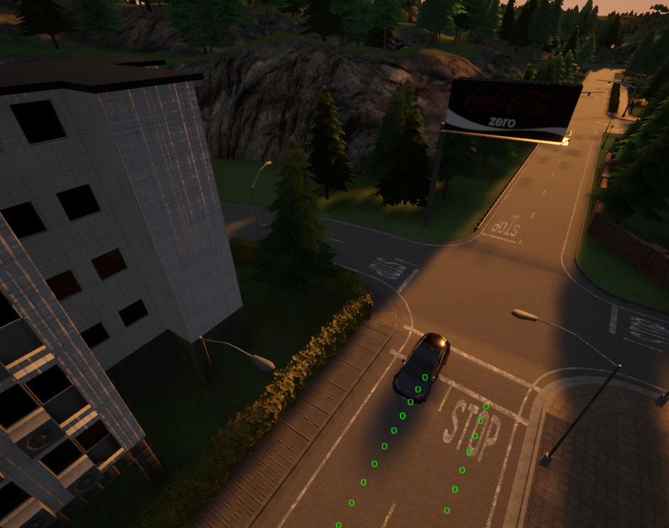
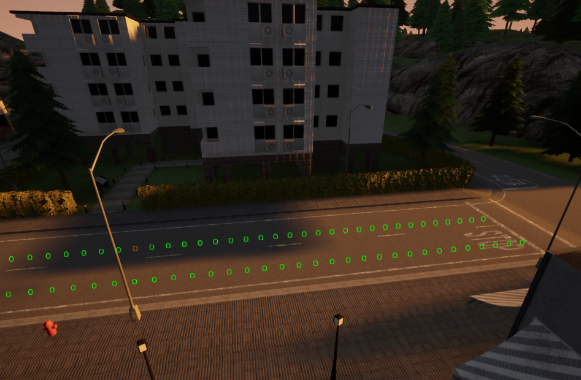
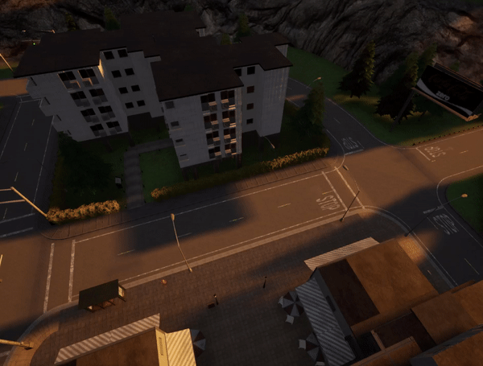

This is a short tutorial on using agents and traffic tools in CARLA. 
This wiki contains details about:
1. Spawning Vehicles in CARLA
2. Controlling these spawned Vehicles using CARLA's PID controllers.

## Pre-requisites
We assume that you have installed CARLA according to instructions on the website. 
This tutorial used CARLA 0.9.8.

Let's begin!
First, start the CARLA server:
```
./CarlaUE4.sh
```
This should open up the CARLA server and you will be greeted with a camera feed:


## Spawning a vehicle in CARLA
Now that we have the CARLA server running, we need to connect a client to it. 
Create a python file, and add the following lines to it:

```
import carla
client = carla.Client('localhost', 2000)
client.set_timeout(2.0)
```

We now have a client connected to CARLA!

Try exploring the city using the mouse and arrow keys. Try moving to a bird's eye view of the city and add the following lines to your code:
```
def draw_waypoints(waypoints, road_id=None, life_time=50.0):

  for waypoint in waypoints:

    if(waypoint.road_id == road_id):
      self.world.debug.draw_string(waypoint.transform.location, 'O', draw_shadow=False,
                                   color=carla.Color(r=0, g=255, b=0), life_time=life_time,
                                   persistent_lines=True)
                                   
waypoints = client.get_world().get_map().generate_waypoints(distance=1.0)
draw_waypoints(waypoints, road_id=10, life_time=20)
```
All roads in CARLA have an associated road_id. The code above will query the CARLA server for all the waypoints in the map, and the light up the waypoints that are present on road with road_id 10. You should see something like this:


This visualization helps us in finding out a good spawn location for a vehicle.
Let's spawn a car somewhere on road 10 now.

We first need to query for the car's blueprint.
```
vehicle_blueprint = client.get_world().get_blueprint_library().filter('model3')[0]
```
This blueprint will be used by CARLA to spawn a Tesla Model 3.

We now need to obtain a spawn location.
```
filtered_waypoints = []
for waypoint in waypoints:
    if(waypoint.road_id == 10):
      filtered_waypoints.append(waypoint)
```
This gives us a list of all waypoints on road 10. Let's choose a random waypoint from this list as the spawn point. This information, together with the blueprint, can be used to spawn vehicles.

```
spawn_point = filtered_waypoints[42].transform
spawn_point.location.z += 2
vehicle = client.get_world().spawn_actor(vehicle_blueprint, spawn_point)
```
The reason for increasing the 'z' coordinate of the spawn point it to avoid any collisions with the road. CARLA does not internally handle these collisions during spawn and not having a 'z' offset can lead to issues.

We should now have a car on road 10.


## Controlling the spawned car
We will be using CARLA's built-in PID controllers for controlling our spawned model 3.

Let's initialize the controller:
```
from agents.navigation.controller import VehiclePIDController
custom_controller = VehiclePIDController(vehicle, args_lateral = {'K_P': 1, 'K_D': 0.0, 'K_I': 0}, args_longitudinal = {'K_P': 1, 'K_D': 0.0, 'K_I': 0.0})
```
This creates a controller that used PID for both lateral and longitudinal control. Lateral control is used to generate steering signals while latitudinal control tracks desired speed. You are free to play around with the Kp, Kd and Ki gains and see how the motion of the car is affected!

Let's choose a waypoint to track. This is a waypoint on the same lane as the spawned car.
```
target_waypoint = filtered_waypoints[50]
client.get_world().debug.draw_string(target_waypoint.transform.location, 'O', draw_shadow=False,
                           color=carla.Color(r=255, g=0, b=0), life_time=20,
                           persistent_lines=True)
```
The tracked waypoint should now be red in color.




Now, track!
```
ticks_to_track = 20
for i in range(ticks_to_track):
	control_signal = custom_controller.run_step(1, target_waypoint)
	vehicle.apply_control(control_signal)
```
You should see something like the GIF below:



## Summary
That's it! You can now spawn and control vehicles in CARLA.

## See Also:
- Follow our work at https://mrsdprojects.ri.cmu.edu/2020teamd/ for more CARLA related demos.

## References
https://carla.readthedocs.io/en/latest/
